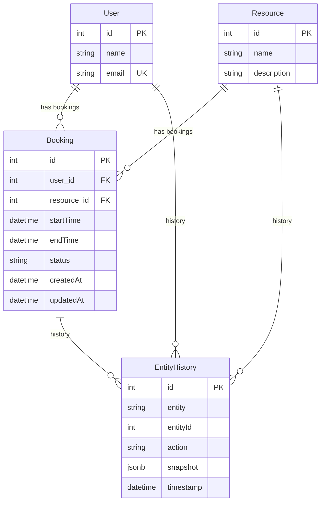

# Blubank Booking Task

A hotel room booking system built with NestJS, TypeORM, PostgreSQL, and CQRS. This project demonstrates clean architecture and best practices for scalable backend development.

---

## 🛠️ Stack Used

- **Node.js** (v18+)
- **NestJS** (v10) - Modular, scalable server-side framework
- **TypeORM** - ORM for PostgreSQL
- **PostgreSQL** - Relational database
- **@nestjs/cqrs** - Official CQRS module for command/query separation
- **Jest** - Unit testing
- **Swagger** - API documentation
- **Docker & Docker Compose** - Containerized development and deployment

---

## 🚀 How to Run the Project

### 1. **With Docker Compose (Recommended)**

This will start the API, PostgreSQL, and seed the database with sample data.

```bash
docker-compose up --build
```
- API: [http://localhost:3000](http://localhost:3000)
- Swagger Docs: [http://localhost:3000/api](http://localhost:3000/api)

**To run tests in Docker Compose:**
```bash
docker-compose run --rm app npm test
```

### 2. **Run Locally (without Docker)**

1. **Install dependencies:**
   ```bash
   npm install
   ```
2. **Start PostgreSQL** (locally or with Docker)
   - Default connection: `localhost:5432`, user: `postgres`, password: `postgres`, db: `booking`
3. **Run database seed:**
   ```bash
   npm run seed
   ```
4. **Start the app:**
   ```bash
   npm run start:dev
   ```
5. **Run tests:**
   ```bash
   npm test
   ```

---

## 🧑‍💻 Design Patterns & Architecture

- **CQRS (Command Query Responsibility Segregation):**
  - All write (create, confirm, cancel) and read (get, list) operations are separated into commands and queries using the official `@nestjs/cqrs` module.
- **Service Layer:**
  - Application logic is encapsulated in NestJS services, which orchestrate domain logic and repositories.
- **Dependency Inversion Principle (DIP):**
  - Services depend on interfaces/abstractions, not concrete implementations (e.g., booking policy).
- **History/Audit Pattern:**
  - All entity changes are recorded in a generic `EntityHistory` table for audit and traceability.

---

## Database Schema



**Relationships:**
- **User ↔ Booking**: One-to-many. Each user can have multiple bookings.
- **Resource ↔ Booking**: One-to-many. Each resource can have multiple bookings.
- **EntityHistory**: Polymorphic. Can reference any entity (user, resource, booking) by name and id.

    
## 🧪 Testing

- **Unit tests** for all services, controllers, and domain logic (Jest)
- **Run all tests:**
  ```bash
  npm test
  # or in Docker Compose:
  docker-compose run --rm app npm test
  ```

---

## 🧩 Features

- **Booking CRUD**: Create, view, confirm, and cancel bookings
- **Availability**: Prevents overlapping bookings
- **CQRS**: All commands and queries separated for scalability
- **History/Audit**: All entity changes are recorded
- **Swagger Docs**: Interactive API documentation at `/api`
- **Database Seeding**: Sample users and rooms are seeded automatically when running with Docker Compose

---

## 📦 Sample Data

When running with Docker Compose, the database is automatically seeded with:
- 3 users (John Doe, Jane Smith, Bob Johnson)
- 5 hotel rooms (Room 101, 102, 103, 201, 202)

---

## 📚 API Documentation

- Visit [http://localhost:3000/api](http://localhost:3000/api) for full Swagger docs and try out all endpoints interactively.

---

## 📝 License

This project is for demonstration and interview purposes.
